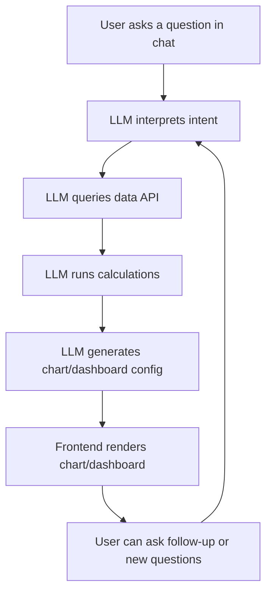

# ClarionAI: The Next-Generation AI Data Analytics Platform

## Vision
ClarionAI is the evolution of ClarionChain.io and Clarionlabs.dev, powered by Bitcoin Research Kit. The goal is to build the most powerful AI data analytics app in the world, enabling users to chat with an LLM and request real-time charts, dashboards, and analytics on Bitcoin and on-chain data.

## End Goal
- Users can chat with an LLM and ask for any chart, metric, or dashboard.
- The LLM interprets the request, queries the data API, runs calculations, and generates charts/dashboards in real time.
- Supports complex requests (e.g., "Show long-term and short-term holder metrics side by side").
- Fully interactive, extensible, and user-friendly.

## Roadmap
### Phase 1: Foundation
1. Define user stories and LLM capabilities.
2. Ensure all data is accessible via a robust API.
3. Build a backend service to orchestrate LLM, data, and chart generation.

### Phase 2: Interactive UI
4. Add a ClarionAI sidebar chat in the app.
5. Enable LLM to generate and render charts/dashboards in response to user queries.
6. Implement feedback loop: LLM can "see" and reason about its own charts.

### Phase 3: Advanced Features
7. Support complex, multi-step queries and dashboard assembly.
8. Allow user personalization, history, and dashboard sharing.
9. Migrate to a dedicated ClarionAI app with expanded features.

### Continuous Improvement
- Add user feedback and correction mechanisms.
- Plan for extensibility and new analytics.
- Ensure security, privacy, and (eventually) real-time collaboration.

## LLM-Driven Analytics Workflow


## Key Requirements
### LLM
- Must interpret user intent, plan data queries/calculations, and generate chart/dashboard configs.
- Should support multi-step reasoning and dashboard assembly.

### Data API
- Expose all relevant Bitcoin and on-chain metrics.
- Add endpoints for new metrics as needed.

### UI
- Sidebar chat interface for ClarionAI.
- Dynamic chart/dashboard rendering in chat.
- Support for multiple chart types and layouts.

## Foundation: Reuse AI Workbench Code
The following code from the AI Workbench tab provides a strong foundation for ClarionAI. It includes chart image capture, LLM chat, and chart rendering logic. Extend and modularize this code for ClarionAI:

```tsx
// src/app/ai-analysis/page.tsx
(use the full code from the file here)
```

## Developer Instructions
- Start by modularizing the AI Workbench code for reuse in ClarionAI.
- Build the backend LLM orchestration service.
- Expand the data API as needed.
- Implement the sidebar chat UI and dynamic chart/dashboard rendering.
- Follow the roadmap and workflow above to reach the end goal.

---

## MCP Server Integration

ClarionAI uses an MCP (Model Control Plane) server as a secure, auditable gateway between the LLM and the data API.

### How It Works
- The LLM never accesses the data API directly.
- All data access is mediated by the MCP server, which exposes structured endpoints for the LLM to use.
- The LLM is configured with tool/function calling to interact with the MCP server.
- The MCP server handles authentication, logging, validation, and data aggregation.
- This architecture ensures security, auditability, and extensibility.

### Architecture
1. **User** interacts with the ClarionAI chat UI.
2. **LLM** receives the user's query and generates a plan.
3. **LLM** sends structured tool/function calls to the MCP server.
4. **MCP server** validates, logs, and fulfills the request by querying the data API.
5. **LLM** receives the data, runs calculations, and generates chart/dashboard configs.
6. **Frontend** renders the results for the user.

### Benefits
- **Security:** Prevents direct LLM access to sensitive APIs.
- **Auditability:** Logs all data access and LLM actions.
- **Extensibility:** Central place to add new data sources, rate limiting, caching, etc.
- **Control:** Restrict, shape, or transform LLM requests before they hit your data layer.

### Example: LLM Tool Call Schema
```json
{
  "name": "get_profit_loss",
  "description": "Fetch profit and loss data for a given asset and time range.",
  "parameters": {
    "asset": { "type": "string", "description": "Asset symbol, e.g., BTC" },
    "start_date": { "type": "string", "description": "Start date (YYYY-MM-DD)" },
    "end_date": { "type": "string", "description": "End date (YYYY-MM-DD)" }
  }
}
```

### Example: MCP Endpoint
```
POST /api/get_profit_loss
{
  "asset": "BTC",
  "start_date": "2023-01-01",
  "end_date": "2023-12-31"
}
```

The MCP server returns the requested data, which the LLM uses to generate charts or dashboards.

---

ClarionAI is the dawn of a new era in AI-driven analytics. Build boldly! 